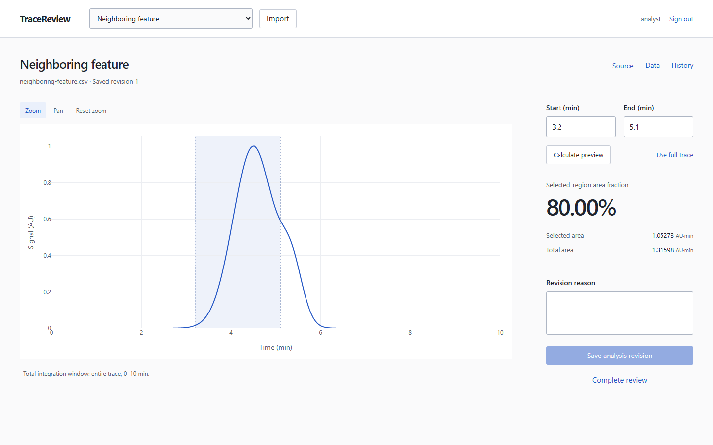

# TraceReview

A local scientific trace-review workspace. Import a prepared CSV trace, select an interval, save reasoned analysis revisions, and complete a review that preserves its exact source and results.

Built with Django, React, NumPy, Plotly and SQLite. MIT licensed. Source publication does not deploy the application or upload its data.



## Run locally on Windows

Requires PowerShell, Git, [uv](https://docs.astral.sh/uv/getting-started/installation/), and [Node.js](https://nodejs.org/en/download) 24.19 or newer in the 24.x series. The repository pins Python 3.13.14; uv supplies it. Installation needs internet access. Normal application use does not.

```powershell
git clone https://github.com/fullstack-nick/TraceReview.git
Set-Location TraceReview
./scripts/setup.ps1
./scripts/build.ps1
./scripts/start.ps1
```

Setup asks for the local `analyst` password and installs the locked Python/npm packages and test browser. Open **http://127.0.0.1:8000** and sign in. Keep the terminal running; Ctrl+C stops the server. There is no default application password. Running setup again preserves the existing account, data, and signing secret.

If PowerShell blocks local scripts, use a session-scoped policy if permitted on your machine: `Set-ExecutionPolicy -Scope Process Bypass`. Do not change a managed machine’s policy without its administrator.

For a different account name, run `./scripts/setup.ps1 -Username yourname`. Change a forgotten password from the project terminal:

```powershell
uv run --locked python backend/manage.py changepassword analyst
```

The built application binds only to loopback. If port 8000 is occupied, stop the service using it or run `./scripts/start.ps1 -Port 8002`. Use the matching URL. Startup never kills an unrelated process. Do not expose the server to a network or use a public tunnel.

## Try the workflow

1. Import `fixtures/neighboring-feature.csv`. Set the interval to **3.2–5.1 min**, calculate a preview, enter a reason, and save revision 1.
2. Change the interval to **3.2–5.8 min**, calculate again, and save a second reasoned revision. The larger interval includes more of the neighboring feature.
3. Open **History**, inspect revision 1, then return to the latest revision. **Data** provides the measured values without relying on the chart.
4. Choose **Complete review**, check the exact revision and interval, and confirm. The run is now read-only.
5. Open the report and download its JSON and original CSV. Restart the application and reopen the same run; the saved result is unchanged.

For a hand-checkable result, import `fixtures/triangle.csv`: total area **2 AU·min**, selected area **1.5 AU·min** for **0.5–1.5 min**, fraction **75%**. `fixtures/invalid-duplicate-time.csv` demonstrates a useful rejection.

## Input and result

CSV must be UTF-8, with optional BOM and LF or CRLF line endings, and exactly these columns:

```csv
time_min,signal_au
0,0
1,2
2,0
```

Files contain 2–2,000 points and at most 256 KiB. Times must be finite and strictly increasing; signals must be finite, nonnegative, and already prepared. Total area must be positive. Blank rows, duplicate times, missing values, extra columns, nonfinite values, and unsupported numeric ranges are rejected. No sorting, smoothing, baseline correction, or row repair occurs.

The selected-region area fraction is `100 × selected area / entire-trace area`. Integration uses straight segments and interpolates boundaries between measured points. This is a mathematical property of the supplied signal; it carries no biological interpretation or sample acceptance decision. See the [calculation specification](docs/calculation.md).

Changing a boundary hides the old selected result until a fresh preview is calculated. Saving always calculates again on the server. Each save needs a reason. Completed reviews retain their exact revision and reject further analysis writes. To perform another review, import the source as a new run.

## Data and recovery

Everything private lives under ignored `.local/`: SQLite data, signing secret, logs, collected assets, and build metadata. Traces, account password hashes, revisions, and source bytes are in `.local/tracereview.sqlite3`. Unsaved boundary edits and reasons exist only in the current browser tab; navigation guards reduce accidental loss but do not recover a crashed tab.

Back up to a **new** path:

```powershell
uv run --locked python backend/manage.py backup_database .local/backups/review-backup.sqlite3
```

This uses SQLite’s consistent backup API, including when the app is running. It refuses to overwrite a file. Keep a protected copy outside the checkout as well. A report JSON is a portable record, not an application database restore format.

To restore, stop the application first. Preserve the current database under a different name, then copy the backup into place. The following assumes the archive name does not already exist:

```powershell
Move-Item -LiteralPath .local/tracereview.sqlite3 -Destination .local/tracereview-before-restore.sqlite3
Copy-Item -LiteralPath .local/backups/review-backup.sqlite3 -Destination .local/tracereview.sqlite3
./scripts/start.ps1
```

For a machine transfer, also preserve `.local/secret_key` separately. Losing the secret ends existing sessions but does not erase the database. Restoring the database restores its accounts and passwords. Never commit `.local/`, credentials, real traces, logs, or private exports.

If a request’s outcome is unknown, use the offered **Retry** action; its operation ID recovers the original committed result. A tab conflict uses **Reload latest**, retains your entries, and requires a new preview. If another tab completed the review, the saved result is shown and local draft values remain available for copying. Session or security-token expiry prompts sign-in and reconciliation.

## Development and verification

```powershell
./scripts/dev.ps1
./scripts/verify.ps1 -IncludeDev
```

Development serves Vite on 127.0.0.1:5173 with a loopback Django proxy on port 8000. Stop the built server first. Verification runs Django checks/migration drift/tests, ESLint, TypeScript, a production build, and Chromium browser tests against both Waitress/WhiteNoise and the development proxy. Omit `-IncludeDev` to run only the production browser mode.

Tests use isolated SQLite databases and ports 8001/5174. Test credentials are restricted to the test harness. Screenshots, reports, and failure traces go to ignored `output/playwright/`. No CI/CD workflows are configured. Windows/Chromium is the validated platform; other operating systems and browsers have not been validated.

See [verification and usability evidence](docs/evidence.md), [workflow](docs/workflow.md), and [architecture/API](docs/architecture.md). The [implementation plan](IMPLEMENTATION_PLAN.md) retains the original proposal and appended research/decisions. Human usability and domain validation remain pending; this project is not a regulated record system or an electronic-signature system.

## Project layout and licensing

| Path | Purpose |
|---|---|
| `backend/review/` | CSV validation, numerical core, models, transaction services, APIs, tests |
| `frontend/src/features/review/` | Workspace, chart, history/data dialogs, reviewed record |
| `fixtures/` | Original deterministic synthetic data and hashes |
| `scripts/` | Local setup, build, serving, verification, notice inventory |
| `docs/` | Concise specifications, evidence, selected screenshots |

TraceReview and its original fixtures are [MIT licensed](LICENSE). Dependencies retain their own terms; see [third-party notices](THIRD_PARTY_NOTICES.md). Regenerate the installed-package inventory with `uv run --locked python scripts/third_party_notices.py` after changing dependencies. Source publication does not upload local application data.
