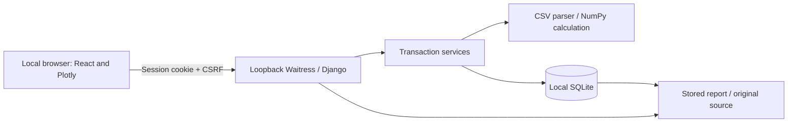

# Local architecture and API

One React/TypeScript feature communicates with a Django/DRF application. SQLite holds the original upload, parsed points, immutable revisions, and audit events. The built Vite assets are served by WhiteNoise and Waitress at 127.0.0.1. The development Vite server proxies `/api/` to Django. There are no remote assets, telemetry, background jobs, cloud services, or CI/CD workflows.

## Data and invariants

`TraceRun` owns the immutable source bytes/SHA-256, parsed points, source/parser/build metadata, authenticated importer, current version, latest revision, and exact reviewed revision. `AnalysisRevision` snapshots boundaries, windows, units, three results, reason, actor/time, source hash, parser/algorithm identifiers, application Git/dirty/runtime metadata. `AuditEvent` records committed import/save/complete actions, their before/after context, version transition, and private retry receipt.

Each import starts at version 1. Each save/completion advances once. SQLite `BEGIN IMMEDIATE` reserves the write transaction; a conditional update also checks owner, draft status, and expected version. Calculation occurs before the short write transaction; state is rechecked inside it. Revision/event or completion/event failure rolls back everything. Read-only record routes take a consistent transactional snapshot. Five-second busy timeout failures return 503 without claiming success.

Mutations carry client UUIDs. The server fingerprints operation, user, run, and canonical validated content. An exact retry returns the original receipt, even if the run has since advanced or completed. Different content or user with the same UUID conflicts. Identical imports with different UUIDs create separate runs intentionally. Retry identifiers/fingerprints are not included in exported audit events.

Revision/audit model save/delete guards and database constraints prevent ordinary accidental rewrites. No public update/delete routes or admin UI exist. These controls do not protect against a person with write access to SQLite or source code; the application is not tamper-proof.

## Session and request contract

| Method/path | Request | Result |
|---|---|---|
| `GET /api/session/` | None | Authenticated user or null, CSRF token |
| `POST /api/login/` | Form `username,password` + CSRF header | Session cookie, user, rotated CSRF token |
| `POST /api/logout/` | CSRF header | 204 |
| `GET /api/traces/?offset=0&limit=50` | Authenticated | Own trace summaries, total/offset/limit; limit capped at 100 |
| `POST /api/traces/` | Multipart `file,request_id,label?` | 201 import receipt, 200 on exact replay |
| `GET /api/traces/{id}/` | Authenticated | Source metadata, points, revisions, audit events, review state |
| `POST /api/traces/{id}/preview/` | JSON `start_time,end_time` | Calculation and observed run version; no writes |
| `POST /api/traces/{id}/revisions/` | JSON `start_time,end_time,reason,expected_version,request_id` | 201 saved receipt, 200 on replay |
| `POST /api/traces/{id}/complete-review/` | JSON `revision_id,expected_version,request_id,review_note?` | 200 completion receipt |
| `GET /api/traces/{id}/report/` | Authenticated, completed | Stable JSON; `?download=1` adds an attachment filename |
| `GET /api/traces/{id}/source/` | Authenticated | Exact original bytes as attachment |
| `GET /api/examples/{filename}/` | Authenticated; filename whitelist | Committed synthetic CSV |

All domain reads filter by importer. Missing and unowned IDs both return 404. Unsafe requests require session CSRF, including login. Session cookies are HttpOnly and SameSite=Lax. Plain HTTP is intentional for loopback; these settings are not a network deployment configuration. Unknown fields are rejected. Reason is trimmed, required, and limited to 1,000 characters; optional review note is at most 2,000, label at most 120.

Errors use `{"error":{"code":"...","message":"...","fields":{...}}}` with optional physical `location` or `current_version`. Codes include `validation_error`, `invalid_csv`, `numeric_range`, `upload_too_large`, `authentication_required`, `csrf_failed`, `version_conflict`, `review_locked`, `idempotency_conflict`, and `database_busy`. Unauthenticated domain requests use 403 with a recognizable code; the UI handles this separately from conflicts. A server-level non-JSON failure is also safely handled.

`tracereview-report-v1` contains trace import identity, exact source bytes in base64 plus hash/filename, review identity/note/build, every revision, and committed audit contexts. Sorted JSON keys, two-space indentation, UTF-8, and a final LF produce deterministic bytes. There is no export timestamp or current recalculation. Authenticated API/source/report responses are private and no-store.

## Browser state and provenance

Raw boundary strings remain separate from parsed numbers and server previews. An abort controller and generation counter discard old preview responses even if transport cancellation fails. Run identity, boundary echoes, and observed run version are checked before displaying a result. Failed writes retain the same payload and UUID; authoritative receipts update the UI before the subsequent detail refresh. Another account’s login clears the old workspace.

Chart code is lazy-loaded. A ResizeObserver supplies its actual container dimensions while `uirevision` preserves viewport state. A chart error boundary leaves the numeric workflow and Data table usable. Hash navigation keeps history/revision/report links local and works with unsaved-change guards.

Build provenance is captured when the running process first needs it and cached for that process. It records Git commit and working-tree dirty flag plus Python, Django, DRF, and NumPy versions; no Git checkout gives a null commit and dirty=true. Stop, build from a clean committed tree, and restart before producing reference records. `.local/build.json` is an operator build summary; saved records own their immutable runtime provenance. The npm and uv lockfiles define the complete dependency environment.
